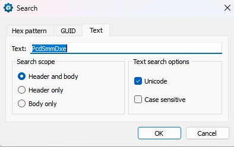
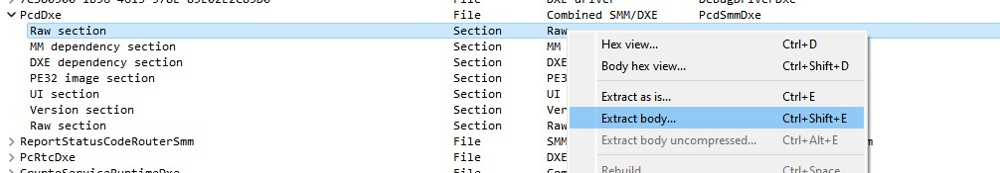
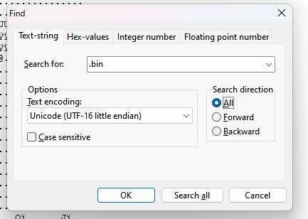

# Tutorial de como fazer o Flash da BIOS do Ideapad Gaming 3 15ARH7 (talvez funcione em outros modelos).

OBS: OS LINKS DIRETOS SÃO PARA O MODELO 15ARH7

Vamos lá, estou fazendo esse tutorial pois passei um perrengue com o meu computador. Estva eu fuçando na "Advanced BIOS" do meu notebook e eu alterei uma configuração (não lembro qual) e quando o PC reiniciou ele deu tela preta.

Mais precisamente os sintomas eram:
* Tela preta
* Coolers giravam
* Era possível sentir o calor do notebook funcionando
* Era possível acender e apagar os leds do teclado
* A luz de POST (led do caps lock) não acendia

Eu tentei entrar em contato com a Lenovo porém, como meu notebook foi comprado em outro país, me negaram assistência mesmo eu estando disposto a pagar por isso.

Após muito pesquisar e vasculhar diversos fóruns e reddits eu encontrei um tutorial no github

Link do tutorial original: https://github.com/nonkerdoob/SmokelessCPU-Guides/blob/main/Guides/BIOS/BIOS_CRISIS.md

---

## Ferramentas necessárias:

[InnoExtract](https://github.com/dscharrer/innoextract/releases)

[7zip](https://www.7-zip.org/download.html)

[UEFITool](https://github.com/LongSoft/UEFITool/releases)
[Link direto para UEFITool](https://github.com/LongSoft/UEFITool/releases/download/A68/UEFITool_NE_A68_win64.zip)

[HeX Editor](https://mh-nexus.de/en/hxd/)

---

## OBTENDO A BIOS DO SEU NOTEBOOK:

Acessar o site da Lenovo: https://pcsupport.lenovo.com/

Navegar até a página de suporte do produto do seu notebook, no meu caso o Ideapad Gaming 3 15ARH7.

Uma vez na página siga para esse caminho: Drivers e Softwares >>> Atualizar Driver Manualmente >>> BIOS

Fazer o download do arquivo.

Link direto: https://download.lenovo.com/consumer/mobiles/jncn48ww.exe

---

## EXTRAINDO A BIOS

A maneira mais fácil para extrair a BIOS é executar o arquivo.

Clique em Next >> Aceite os termos >>> Next >>> Selecionar "Extract Only" >>> Extract

A pasta padrão é: "C:\Drivers\Flash\xxxxxxxxxx", onde o xxxxxxx é a pasta final.

Vá até a pasta, haverá um arquivo .exe dentro dela.

Clique com o botão direito e com o 7zip, mande extrair novamente (de preferencia em outro local, pois dá um erro de permissão)

Navegue até a nova pasta que você extraiu os arquivos

---

## IDENTIFICANDO A IMAGEM DA BIOS

Nesta pasta haverão aproximadamente 15 arquivos

No tutorial original ele diz para procurar por um arquivo cuja extensão é ".fd"

Ao fazer os passos acima, para o meu notebook esse arquivo não existia, porém, existia um arquivo ".rom"

Copie esse arquivo esse arquivo para outra pasta (o do meu note o arquivo se chama "HLG52208.rom")

No próximo passo, você irá descobrir o nome para renomear esse arquivo

---

## DESCOBRINDO O NOME DA SUA BIOS

Aqui eu apenas irei reproduzir o passo a passo do tutorial original

Abra o arquivo ROM no UefiTool

Procurar a cadeia de caracteres Unicode "PcdSmmDxe"

Haverá apenas um resultado: clique duas vezes sobre ele

Agora clique na seção bruta do e extraia-o como corpo "PcdSmmDxe"

Abra o arquivo extraído com o editor hexadecimal

Procurar a cadeia de caracteres UNICODE/UTF-16.bin

Haverá apenas uma partida

O fileName a ser usado está lá, neste caso, é , ignore o ponto, entre cada letra como é o preenchimento UTF16 (0x00 byte)EUCrisis.bin

OBS: ESSE NOME PODE VARIAR, O DO MEU NOTEBOOK ERA JNCN.BIN

Abaixo uma lista de possíveis nomes:

| BIOS Type | Crisis Name   |
|-----------|---------------|
| EUCN      | EUCrisis.bin  |
| BHCN      | BHCrisis.bin  |
| H1CN      | h1cn.bin      |
| GKCN      | gkcn.bin      |
| KWCN      | kwcn.bin      |
| JNCN      | jncn.bin      |

APÓS DESCOBRIR O NOME DA SUA BIOS, VOCÊ IRÁ RENOMEA-LA E TROCAR A EXTENSÃO PARA ".BIN" CASO SEJA OUTRA.

---

## CRIAR UM PEN DRIVE

Formate um pen drive em FAT32, GPT (O jeito mais fácil é usar o Rufus e criar uma imagem com o FreeDos, após isso, vá no pen drive e apague os arquivos)

Depois de formatado, copie a imagem ".bin" já com o nome correto para dentro do pen drive

No meu caso, o pen drive só contém um arquivo nele "jncn.bin"

---

## FLASH NA BIOS

Com o Note desligado e desconectado da tomada

Insira o pen drive

Aperte "FN + R" e segure (você irá segurar por uns 2 a 5 minutos)

Insira o cabo de energia no note e ligue o note (continue segurando "FN + R")

Você irá reparar que o note liga com o Led do botão power desligado

Quando você ouvir um beep (é alto) pode soltar as teclas "FN + R"

O computador irá ficar beepando por uns 5 a 8 minutos (pelo menos o meu)

Ele irá reiniciar sozinho (demora mais uns 5 minutos até aparecer a logo da Lenovo)

---

## CONCLUÍDO

Eu refiz esse compilado pois eu não encontrei nenhuma informação sobre como fazer isso corretamente na internet, ou então as informações estavam em inglês, ou incompletas.

Espero que isso facilite a sua vida

Todos os créditos para o autor original SmokelessCPU.

Obrigado.